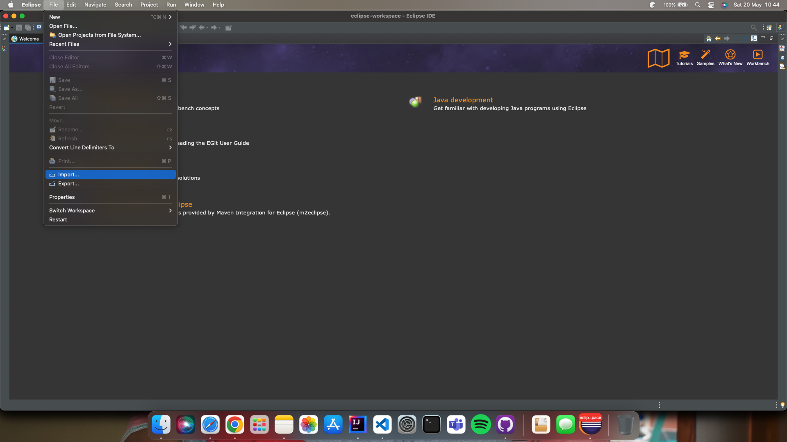
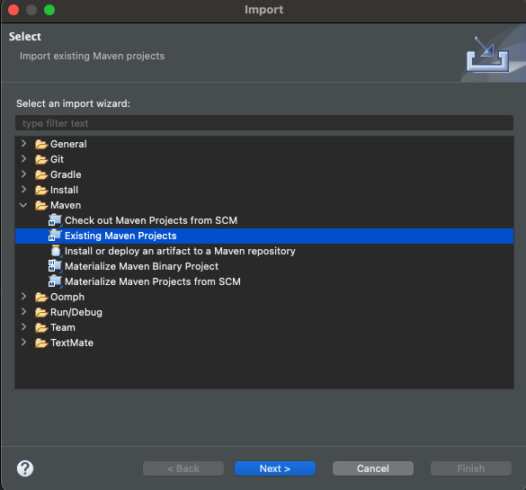

# 1. Create Spring Boot Basic Application in Eclipse IDE

The Java Integrated Development Environment (IDE) is well-known in the Eclipse IDE.

# **Steps:**

1. Install Eclipse IDE for **Enterprise Java and Web Developer**
2. Create a Spring Boot Project using Spring Initializr.
3. Import Spring Boot Project in Eclipse IDE.
4. Search for "maven" and Choose Existing Maven Project.
5. Choose **Next**.
6. Click on the **Browse** button and select the extracted zip.
7. Click on the **Finish** button, and we are done with the creating the spring boot project.

## Step1: Installation of Eclipse IDE

- Install Eclipse IDE by going through [Tools & Prerequisites](ToolsForTheCourse.md)

## Step2: Create a Spring Boot Project using Spring Initializr
- Setting up a Spring Project using spring initializr http://start.spring.io
  
In the above image, please select the following options
- Project as `Maven` or `Gradle`
- Language as `Java` or `Kotlin`
- Spring Boot Version as `3.0.7` or _**latest one**_
- Project Metadata as 
    - Group as `com.springcourse`
    - Artifact as `learn-spring`
    - Name as `learn-spring`
    - Description can be your choice
    - Package automatically generate by the tool based on **Group, Artifact**
    - Type "web" into the search box, and we'll obtain Spring Web and add it.

## Step3: Import Spring Boot Project in Eclipse IDE

- Open Eclipse
    - File -> Import -> Existing Maven Project -> Navigate to the folder where you unzipped the zip
    - Select the right project

## Step4: Search for "maven" and Choose Existing Maven Project and Choose **Next** button

